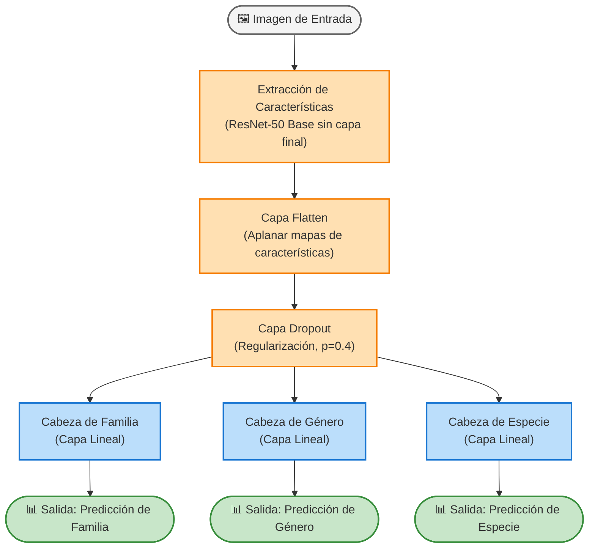
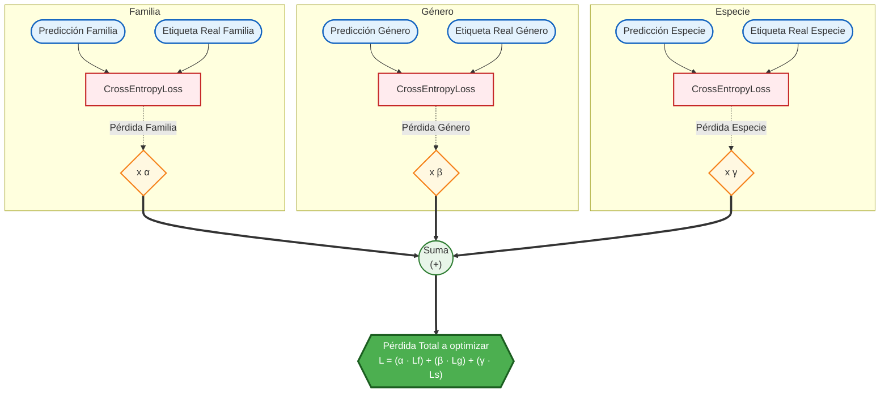

# Taxo-Net

Este repositorio contiene el código y los modelos relacionados con Taxo-Net.

## Modos de Operación

*   **Entrenamiento (Train):** Este proceso toma el conjunto de datos de imágenes y ajusta los pesos de la red neuronal mediante iteraciones. Está diseñado para que la arquitectura aprenda a identificar características clave de las distintas categorías jerárquicas taxonómicas (familia, género, especie).
*   **Inferencia (Inference):** Una vez que el modelo ha sido entrenado, la inferencia se encarga de cargar los pesos resultantes para predecir sobre nuevas imágenes que el modelo nunca ha visto. Este proceso recibe una imagen y produce su correspondiente predicción taxonómica.

## Notas Importantes

1. **Rutas (Paths) en el Notebook de Entrenamiento:** El notebook para el entrenamiento de los modelos fue entrenado y ejecutado originalmente en una máquina Linux. Por lo tanto, si deseas ejecutarlo, asegúrate de que las **rutas de los archivos y directorios** sean actualizadas para que funcionen correctamente según tu sistema operativo local (Windows, macOS o Linux).
2. **Rutas en el Modelo:** De manera similar, si ejecutas el modelo o la inferencia, asegúrate de modificar todas las rutas en el código para que sean compatibles con el sistema operativo (SO) que estés usando, ya que el modelo también fue desarrollado en Linux.
3. **Descarga del Modelo Entrenado:** El modelo ya entrenado en estas condiciones se encuentra disponible para su descarga en el siguiente enlace de Google Drive:
   - 🔗 [Descargar Modelo Taxo-Net (Google Drive)](https://drive.google.com/file/d/1rBmSa5VPeBnj02JPi1QTVeouMM7Df4Mm/view?usp=drive_link)

## Arquitectura del Modelo (TaxoNet_ResNet50)

La arquitectura base del modelo consta de la extracción de características mediante ResNet-50 y tres derivaciones (cabezas de clasificación) independientes encargadas de realizar predicciones estructuradas:

## Función de Pérdida (TaxonomicPenaltyLoss)

Esta red es guiada por una métrica de pérdida unificada, donde los errores de clasificación en Familia, Género y Especie son castigados individualmente según ciertos pesos multiplicadores:

